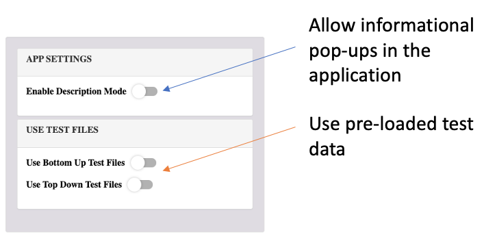
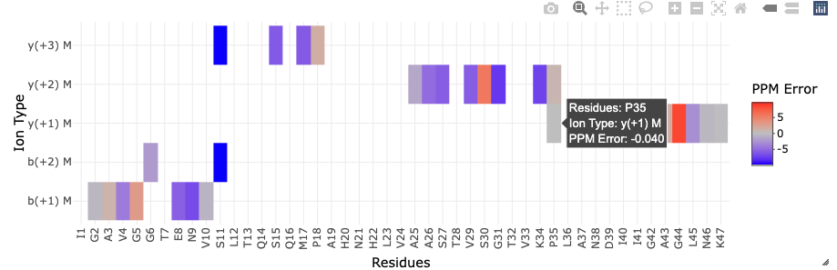
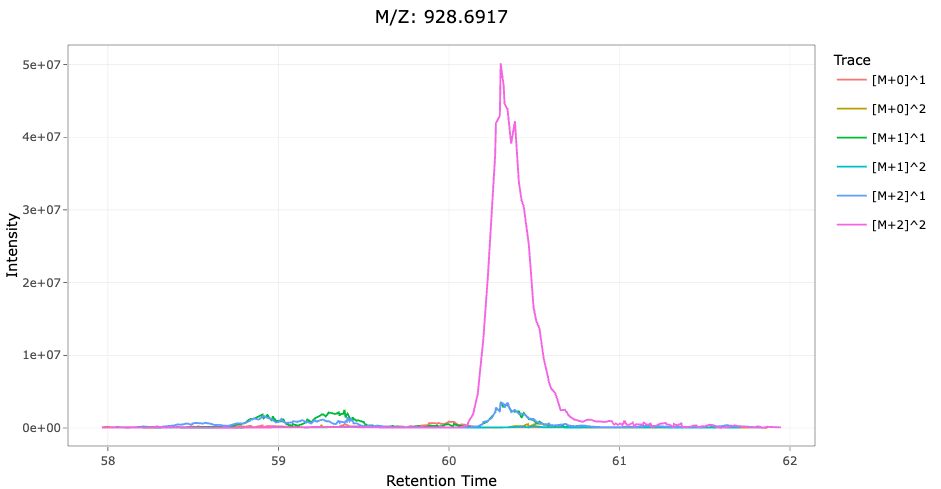
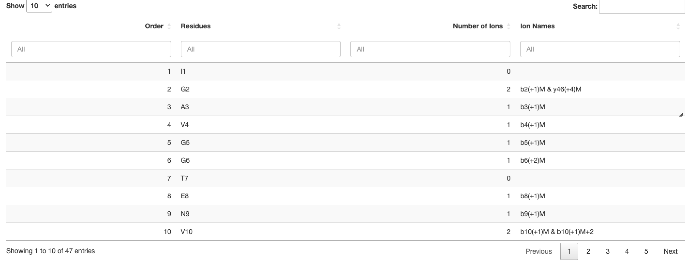

```{r setup, include=FALSE}
knitr::opts_chunk$set(echo = TRUE)
```

# PSpecteR Description

## Abstract

Visual examination of mass spectrometry data is necessary to assess data quality and to facilitate data exploration. Graphics provide the means to evaluate spectral properties, test alternative peptide/protein sequence matches, prepare annotated spectra for publication, and fine-tune parameters during wet lab procedures. Visual inspection of LC-MS data is hindered by proteomics visualization software designed for particular workflows (e.g. bottom-up or top-down analyses; support for ThermoFisher raw files or XML-based, etc.) or vendor specific tools without open-source code. We built PSpecteR, an open-source and interactive R Shiny web application to address these issues, with support for several steps of proteomics data processing, including: reading various mass spectrometry files, running open-source database search engines, labelling spectra with fragmentation patterns, testing post-translational modifications, plotting where identified fragments map to reference sequences, and visualizing algorithmic output and metadata. All figures, tables, and spectra are exportable within one easy-to-use graphical user interface. Our current software provides a flexible and modern R framework to support fast implementation of additional features. The open-source code is readily available (https://github.com/EMSL-Computing/PSpecteR), and a PSpecteR Docker container (https://hub.docker.com/r/emslcomputing/pspecter) is available for easy local installation.

## Version Explanations 

There are two version of PSpecteR:

**PSpecteR**: The full version of the application which includes the ability to run
MS-GF+ and MSPathFinder. 

**PSpecteR Light:** A simpler version of the application which does not include 
MS-GF+ and MSPathFinder. It also does not include file autodetection and loading.

## Module Descriptions

```{r ModuleDescription, echo = FALSE}
knitr::include_graphics("ModuleDescriptors.png")
```

**Upload Data:** Upload either an XML-based (.mzML, .mzXML) MS file, or a ThermoFisher (.raw) file.
For identification data, currently only mzid data is supported. FASTA files are optional. 
Example datasets are included within the application. 

**MS & XIC:** Visualize peptide and protein identifications overlayed on experimental
mass spectra data. Extracted ion chromatograms are also calculated and visualized. 

**Test and Visualize PTMs:** Use ProForma strings to test the fit of alternative 
proteoforms. There are widgets and shorthand options to test multiple modifications
quickly. Any unique modifications can be added in the glossary. 

**Protein Coverage:** Visualize where identified peptides overlay on protein sequences. 

**Additional Plots:** There are 2 available plots - plotting metadata, and ProMex
(part of the MSPathFinder suite) feature identification data.

## Note about all data and plots

All data from the application can be exported with widgets in the sidebar, and 
all plots are resizable with a draggable symbol on the bottom right hand corner. 
Quick snapshots of plots can be taken within the plot windows with the camera icon.
For higher quality images, take image snapshots with widgets in the sidebar and 
export with the button in the top right of the application called "Export Snapshot
Images."

# Upload Data 

This page allows the user to upload:

* A required mass spectrometry file (MS): mzML, mzXML, or Thermo Fisher raw

* An optional protein ID file (ID): mzid

* An optional protein database file (FA): fasta

You may also choose the test files at the bottom of the "Upload Data" page. There 
is also a description mode with pop-ups that we suggest new users try out. 

```{r UploadData, echo = FALSE}

```

## PSpecteR Light

Click "Browse" to open your system's file explorer to upload your data. 

## PSpecteR

Click a dropdown menu to set the output directory or upload an MS, ID, or FA file. Use the “Search Folders” button to select a file,

```{r, echo = FALSE}
knitr::include_graphics("UploadGif1.gif")
```

or type in an acceptable file path, which will give a check mark for a correct path or a red X for an incorrect path. Click “Use Path” to load the file, or “Clear Path” to remove it. When typing in a MS file path, if the ID and FA file paths have the same name, directory, and correct extension, they will autofill.

```{r, echo = FALSE}
knitr::include_graphics("UploadGif2.gif")
```

# MS & XIC 

## Page Description

MS & XIC allows you to see how well a peptide sequence maps to a specific MS scan. 
Visualize fragmentation patterns, extracted ion chromatograms (XICs), the best 
identified fragment ion per peptide, and more.

## Plots and Tables

All plots are plotly graphics which allow for zooming, panning, autoscaling, and 
filtering by category within the legend. All tables are DT tables which can be 
sorted (multi-sorting is enabled with shift), searched, and subsetted.

```{r MS, echo = FALSE}
knitr::include_graphics("MSMatchedPeaks.gif")
```

**MS/MS:** Hover over the peaks to get the identified ion name, m/z value, and 
intensity value. Ion names are broken down into fragment type (N-terminus: a, b, 
c; C-terminus: x, y, z), charge in superscript, and isotope (M+n). Specific 
fragments can be selected with the table under ‘Filter Ions.” Colors for ion types 
are consistent throughout figures: a - green, b - blue, c - purple, x - dark pink, 
y - red, and z - orange. Use the "Filter Ions" table to select specific peaks, 
and "Peak Matching Settings" to change tolerances, minimal correlations, etc. Set
label sizes and distances with "Plot Settings" and "Spectrum Plot Settings."

```{r ErrorMap, echo = FALSE}

```

**Error Map:** See the PPM error (how far off the theoretical m/z is from the experimental m/z) 
per residue and ion type. Too many ions? Try removing isotopes in the "Peak Match Settings."
Each square is colored by PPM error where red indicates a positive error and blue 
a negative error. PPM error is calculated by (experimental mz - theoretical mz / 
theoretical mz) * 1e6. 

```{r XIC, echo = FALSE}

```

**XIC:** Generate XICs (extracted ion chromatograms) of the intensity vs retention 
time peaks across all MS1 scans for peaks with the XIC MZ value. Traces can be 
specified as isotopes and adjacent charge states. Use the charge state slider to 
make XICs based on the number of isotopes (i.e. selected isotopes of 0, 1, 2 
would result in traces for mz + 0/charge, mz + 1/charge, mz + 2/charge) or based 
on adjacent charge state (i.e. selected charges of 1, 2, 3 woud result in traces o
f mz/1, mz/2, mz/3). Retention time and intensity data are drawn collectively 
from all the MS1 scans in the file. You can change charges, retention time windows,
isotopes and charges in XIC Settings. 

```{r MS1Plot, echo = FALSE}
knitr::include_graphics("MS1Plot.png")
```

**Previous/Next MS1:** View the MS1 precursor spectrum with labelled isotopes and 
within the isolation window for previous and next precursors. The red lines are 
indicative of the theoretical m/z value for a given peptide. Hover over boxes 
display m/z, intensity, isotope, reference intensity listed as a proportion, 
and the percent difference (exp intensity - theo intensity / exp intensity) * 100%. 
Matched ions can be filtered by percent difference. Percent error filtering and
MS1 window sizes can be changed in "MS1 Plot Settings" under "Plot Settings." 

```{r FilterIons, echo = FALSE}
knitr::include_graphics("FilterIons.gif")
```

**Filter Ions:** Filter the annotated MS/MS spectra by selecting ions in the 
filter ions table. Ion data can be exported under "Export Data" with the 
"Export Matched (Annotated) Peak Data"

```{r ScanMetadata, echo = FALSE}
knitr::include_graphics("UsingtheTable.gif")
```

**Scan Metadata Table:** View metadata from both MS and ID files. From the MS data, 
scan number, MS level, retention time, precursor m/z, precursor charge, precursor scan, 
and activation method are extracted. From the ID data, sequence, protein ID, mass, score, 
q-value (an adjusted p-value based on false discovery rate - FDR), whether the 
protein is a decoy (reverse sequence peptide used to calculate FDR), and a 
protein description are extracted. Clicking on a row will trigger all the 
Scan and XIC visualization. Columns can be added or removed with "Table Column Settings." 
Tables can be searched (dialog boxes) and sorted (arrows). To select a range, like from 3 to 5, 
type "3 … 5" into the search box. Holding shift allows for sorting with multiple 
categories. Above the scan metadata is the number of peaks for that mass spectra, 
along with coverage, which is the perecentage of amino acids in the sequence with
at least one fragment assigned to it, excluding the first amino acid from the 
N-terminus direction. The table can be scrolled horizontally if not all the 
columns fit. All data for this table can be exported in "Export Data" with 
"Export Scan Metadata". For a selected spectra, export peak data with "Export
Peak Data." 

```{r SequencePlot, echo = FALSE}
knitr::include_graphics("SequencePlot.png")
```

**Annotated Sequence:** See the lowest ppm error per N-terminus (a, b, or c) 
and C-terminus (x, y, or z) ion per residue. Hover-over to see the PPM error of 
each fragment. Post-translational modifications are visualized with small
boxes and the first 6 characters of their name. Use the Glossary page to add your
own modifications. There are several options to make these plots more appealing
under "Plot Settings" and "Sequence Plot Settings". You can add or remove charge
states, set the plot wrap size (number of residues per line), add or remove
modification annotations, and set the annotation label size. 

```{r IonAnnotation, echo = FALSE}

```

**Ion Annotation:** See counts of ions supporting each residue. The format is 
ion type (a, b, c, x, y, z), charge state, and isotope (written like M+n). The 
monoisotopic peak is just an M. 

```{r IonBarplot, echo = FALSE}
knitr::include_graphics("IonBarChart.png")
```

**Ion Bar Chart:** See the number of ions identified per type. Get counts of all
ions, ions with isotopes removed, and completely unique ions per charge state (without
isotopes or charge states). 

## Input Widgets

**Peak Match Settings**

*PPM Tolerance:* The ppm error threshold between calculated fragments. Default is 10. 

*Intensity Minimum:* A filter that removes intensity values below this threshold. Can
be used to reduce the number of peaks plotted in a spectra. 

*Minimum Pearson Correlation Score:* A minimum correlation score to filter isotopes 
by. Range is 0 to 1. Default is 0. This filter is more useful for top-down datasets.

*Ion Type:* Determine which ion types to calculate. a, b, c, x, y, z are supported. 
Additional ion types can be added in "Manage Ions." 

*Include Isotopes:* A logical to indicates whether isotopes should be calculated. 
FALSE = Faster Calculations. Default is TRUE. 

*Manage Ions:* A button that opens up a menu for adding up to 6 mass modified 
ions per ion type. Users can select their ion type, a symbol (+, ++, -, --, ^, ^^), 
and the mass change to represent that change. The new mass modified ion will then
show up in the Ion Type selection and can be added to any spectra. 

*Test Different Sequence:* Enter an amino acid string or ProForma string (amino acid
with mass modifications in brackets) to see its fit on the selected spectra. Modifications
are pulled from the Glossary. Unknown mass shifts are also supported. To test a sequence, 


# App Installation & Launch

## Docker Design

```{r ContainerDesign, echo = FALSE}
knitr::include_graphics("ContainerDesign.png")
```

PSpecteR is comprised of three Docker containers: one for the Shiny app architecture, and two for the peptide database search tools MS-GF+ and MSPathFinderT. These containers share a mounted volume (data) for all file inputs and outputs (black arrows). The Shiny app container communicates with the other containers to start the database searches and return their status (blue arrows).

The MS-GF+ and MSPathFinder containers are built as python flask apps with a redis server in the background and managed by celery tasks. PSpecteR constructs the URL calls to pass parameters and files to the other containers, and then the URL to check the task id of the current running jobs.

## Installation

We suggest downloading Docker Desktop at https://www.docker.com/products/docker-desktop.

Create a directory called PSpecteR_Launch. Enter the folder and add a directory called data and copy the Docker-Compose file from https://github.com/EMSL-Computing/PSpecteR/tree/master/pspecter_container/DockerComposeFiles/ForDockerHub.

For MacOS Terminal:

```{r MacOS, eval = FALSE}
mkdir PSpecteR_Launch; cd PSpecteR_Launch; mkdir data; wget https://raw.githubusercontent.com/EMSL-Computing/PSpecteR/master/pspecter_container/DockerComposeFiles/ForDockerHub/docker-compose.yml
```

For Windows Powershell:

```{r Windows, eval = FALSE}
mkdir PSpecteR_Launch; cd PSpecteR_Launch; mkdir data; wget https://raw.githubusercontent.com/EMSL-Computing/PSpecteR/master/pspecter_container/DockerComposeFiles/ForDockerHub/docker-compose.yml -Outfile docker-compose.yml
```

Pull the latest versions of the PSpecteR, MS-GF+, and MSPathFinderT containers.

For MacOS terminal: 

```{r MacOS2, eval = FALSE}
docker pull emslcomputing/pspecter:1.0.0; docker pull emslcomputing/msgf:1.0; docker pull emslcomputing/mspathfindert:1.0
```

For Windows Powershell: 

```{r Windows2, eval = FALSE}
$env:PSPECTER_DATA = "."; docker-compose up -d 
```

More details on the windows-specific issue can be found here: https://github.com/microsoft/WSL/issues/4387

## Launch with Docker

In the PSpecteR_Launch directory, declare the PSPECTER_DATA variable and use the docker compose file.

For MacOS Terminal:

```{r DockerMacOS, eval = FALSE}
export PSPECTER_DATA=$PWD; docker-compose up
```

For Windows Powershell: 

```{r DockerWindows, eval = FALSE}
$env:PSPECTER_DATA = "."; docker-compose up
```

Open with Docker Desktop or by going to http://localhost:3838/


