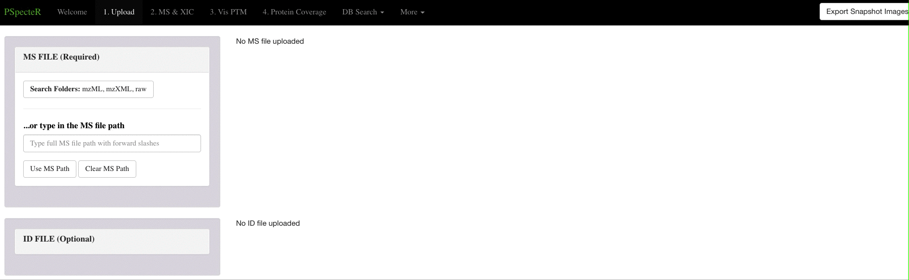

```{r setup, include=FALSE}
knitr::opts_chunk$set(echo = TRUE)
```

# PSpecteR Description

## Abstract

Visual examination of mass spectrometry data is necessary to assess data quality and to facilitate data exploration. Graphics provide the means to evaluate spectral properties, test alternative peptide/protein sequence matches, prepare annotated spectra for publication, and fine-tune parameters during wet lab procedures. Visual inspection of LC-MS data is hindered by proteomics visualization software designed for particular workflows (e.g. bottom-up or top-down analyses; support for ThermoFisher raw files or XML-based, etc.) or vendor specific tools without open-source code. We built PSpecteR, an open-source and interactive R Shiny web application to address these issues, with support for several steps of proteomics data processing, including: reading various mass spectrometry files, running open-source database search engines, labelling spectra with fragmentation patterns, testing post-translational modifications, plotting where identified fragments map to reference sequences, and visualizing algorithmic output and metadata. All figures, tables, and spectra are exportable within one easy-to-use graphical user interface. Our current software provides a flexible and modern R framework to support fast implementation of additional features. The open-source code is readily available (https://github.com/EMSL-Computing/PSpecteR), and a PSpecteR Docker container (https://hub.docker.com/r/emslcomputing/pspecter) is available for easy local installation.

## Version Explanations 

There are two version of PSpecteR:

**PSpecteR**: The full version of the application which includes the ability to run
MS-GF+ and MSPathFinder. 

**PSpecteR Light:** A simpler version of the application which does not include 
MS-GF+ and MSPathFinder. It also does not include file autodetection and loading.

## Module Descriptions

```{r ModuleDescription, echo = FALSE}
knitr::include_graphics("ModuleDescriptors.png")
```

**Upload Data:** Upload either an XML-based (.mzML, .mzXML) MS file, or a ThermoFisher (.raw) file.
For identification data, currently only mzid data is supported. FASTA files are optional. 
Example datasets are included within the application. 

**MS & XIC:** Visualize peptide and protein identifications overlayed on experimental
mass spectra data. Extracted ion chromatograms are also calculated and visualized. 

**Test and Visualize PTMs:** Use ProForma strings to test the fit of alternative 
proteoforms. There are widgets and shorthand options to test multiple modifications
quickly. Any unique modifications can be added in the glossary. 

**Protein Coverage:** Visualize where identified peptides overlay on protein sequences. 

**Additional Plots:** There are 2 available plots - plotting metadata, and ProMex
(part of the MSPathFinder suite) feature identification data.

# Upload Data 

This page allows the user to upload:

* A required mass spectrometry file (MS): mzML, mzXML, or Thermo Fisher raw

* An optional protein ID file (ID): mzid

* An optional protein database file (FA): fasta

You may also choose the test files at the bottom of the "Upload Data" page. There 
is also a description mode with pop-ups that we suggest new users try out. 

```{r UploadData, echo = FALSe}
knitr::include_graphics("DescriptionsAndData.png")
```

## PSpecteR Light

Click "Browse" to open your system's file explorer to upload your data. 

## PSpecteR

Click a dropdown menu to set the output directory or upload an MS, ID, or FA file. Use the “Search Folders” button to select a file,

```{r, echo = FALSE}

```

or type in an acceptable file path, which will give a check mark for a correct path or a red X for an incorrect path. Click “Use Path” to load the file, or “Clear Path” to remove it. When typing in a MS file path, if the ID and FA file paths have the same name, directory, and correct extension, they will autofill.

```{r, echo = FALSE}
knitr::include_graphics("UploadGif2.gif")
```

# MS & XIC 

## Page Description

MS & XIC allows you to see how well a peptide sequence maps to a specific MS scan. 
Visualize fragmentation patterns, extracted ion chromatograms (XICs), the best 
identified fragment ion per peptide, and more.

## Plots and Tables

All plots are plotly graphics which allow for zooming, panning, autoscaling, and 
filtering by category within the legend. All tables are DT tables which can be 
sorted (multi-sorting is enabled with shift), searched, and subsetted.

**MS/MS:** Hover over the peaks to get the identified ion name, m/z value, and 
intensity value. Ion names are broken down into fragment type (N-terminus: a, b, 
c; C-terminus: x, y, z), charge in superscript, and isotope (M+n). Specific 
fragments can be selected with the table under ‘Filter Ions.” Colors for ion types 
are consistent throughout figures: a - green, b - blue, c - purple, x - dark pink, 
y - red, and z - orange. 

# App Installation & Launch

## Docker Design

```{r ContainerDesign, echo = FALSE}
knitr::include_graphics("ContainerDesign.png")
```

PSpecteR is comprised of three Docker containers: one for the Shiny app architecture, and two for the peptide database search tools MS-GF+ and MSPathFinderT. These containers share a mounted volume (data) for all file inputs and outputs (black arrows). The Shiny app container communicates with the other containers to start the database searches and return their status (blue arrows).

The MS-GF+ and MSPathFinder containers are built as python flask apps with a redis server in the background and managed by celery tasks. PSpecteR constructs the URL calls to pass parameters and files to the other containers, and then the URL to check the task id of the current running jobs.

## Installation

We suggest downloading Docker Desktop at https://www.docker.com/products/docker-desktop.

Create a directory called PSpecteR_Launch. Enter the folder and add a directory called data and copy the Docker-Compose file from https://github.com/EMSL-Computing/PSpecteR/tree/master/pspecter_container/DockerComposeFiles/ForDockerHub.

For MacOS Terminal:

```{r MacOS, eval = FALSE}
mkdir PSpecteR_Launch; cd PSpecteR_Launch; mkdir data; wget https://raw.githubusercontent.com/EMSL-Computing/PSpecteR/master/pspecter_container/DockerComposeFiles/ForDockerHub/docker-compose.yml
```

For Windows Powershell:

```{r Windows, eval = FALSE}
mkdir PSpecteR_Launch; cd PSpecteR_Launch; mkdir data; wget https://raw.githubusercontent.com/EMSL-Computing/PSpecteR/master/pspecter_container/DockerComposeFiles/ForDockerHub/docker-compose.yml -Outfile docker-compose.yml
```

Pull the latest versions of the PSpecteR, MS-GF+, and MSPathFinderT containers.

For MacOS terminal: 

```{r MacOS2, eval = FALSE}
docker pull emslcomputing/pspecter:1.0.0; docker pull emslcomputing/msgf:1.0; docker pull emslcomputing/mspathfindert:1.0
```

For Windows Powershell: 

```{r Windows2, eval = FALSE}
$env:PSPECTER_DATA = "."; docker-compose up -d 
```

More details on the windows-specific issue can be found here: https://github.com/microsoft/WSL/issues/4387

## Launch with Docker

In the PSpecteR_Launch directory, declare the PSPECTER_DATA variable and use the docker compose file.

For MacOS Terminal:

```{r DockerMacOS, eval = FALSE}
export PSPECTER_DATA=$PWD; docker-compose up
```

For Windows Powershell: 

```{r DockerWindows, eval = FALSE}
$env:PSPECTER_DATA = "."; docker-compose up
```

Open with Docker Desktop or by going to http://localhost:3838/


